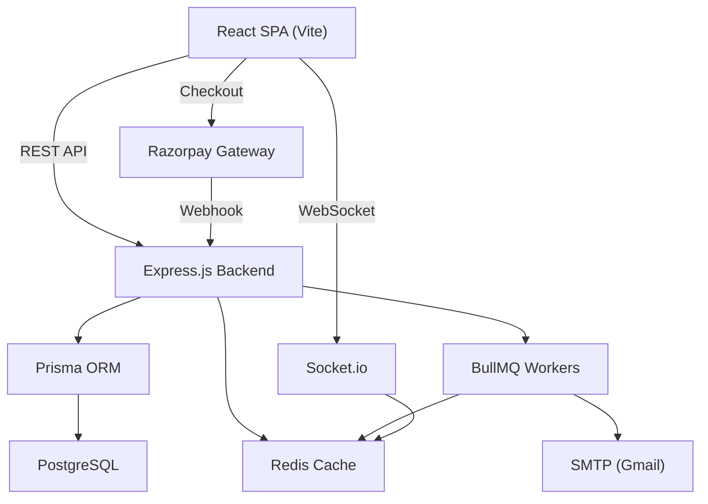

<div align="center">
  <h1>🎓 Kits Akshar Institute of Technology — College ERP</h1>
  <p>A production-grade Enterprise Resource Planning system for complete institutional management.</p>
  
  []()
  []()
  []()
  []()
  []()
  []()
  []()
</div>

<br />

---

## 📑 Table of Contents

1. [Executive Summary](#1-executive-summary)
2. [Core Modules](#2-core-modules)
3. [Technology Stack](#3-technology-stack)
4. [System Architecture](#4-system-architecture)
5. [Project Structure](#5-project-structure)
6. [Prerequisites](#6-prerequisites)
7. [Installation & Setup](#7-installation--setup)
8. [Environment Variables](#8-environment-variables)
9. [Database Setup](#9-database-setup)
10. [API Reference](#10-api-reference)
11. [Frontend Architecture](#11-frontend-architecture)
12. [Real-Time Features](#12-real-time-features)
13. [Payment Integration](#13-payment-integration)
14. [Security Architecture](#14-security-architecture)
15. [Caching Strategy](#15-caching-strategy)
16. [Background Jobs](#16-background-jobs)
17. [Deployment](#17-deployment)
18. [Troubleshooting](#18-troubleshooting)
19. [License](#19-license)

---

## 1. Executive Summary

This unified ERP platform centralizes all core operations for **Kits Akshar Institute of Technology**:

- **Authentication** — JWT with refresh token rotation, account locking, Redis-based blacklisting
- **Attendance** — Bulk marking, correction with audit trail, defaulters detection, monthly reports
- **Examinations** — Session management, marks entry with validation, SGPA/CGPA calculation, hall ticket generation
- **Finance** — Fee structures, automated invoice generation (KITS-YYYY-NNNNNN format), Razorpay payment gateway
- **Operations** — Hostel block/room allocation, library book issue/return with fines, transport route & pass management
- **Analytics** — Dashboard aggregations with Redis caching for admin, faculty, and student views
- **Notifications** — In-app notifications, real-time WebSocket push, SMTP email delivery
- **Exam Cell (Legacy)** — 20+ page autonomous exam cell module with independent Drizzle-based database operations

The system enforces strict **Role-Based Access Control (RBAC)** across 11 role types.

---

## 2. Core Modules

### 🔐 Authentication & Authorization
| Feature | Details |
|---------|---------|
| JWT Access + Refresh Tokens | 15m access / 7d refresh, automatic rotation |
| Account Locking | 5 failed attempts → 30 min lockout |
| Token Blacklisting | Redis-based revocation on logout |
| Password Reset | Email-based with 1-hour expiry tokens |
| RBAC Roles | `SUPER_ADMIN`, `ADMIN`, `HOD`, `FACULTY`, `STUDENT`, `EXAM_CELL`, `ACCOUNTS`, `HOSTEL_WARDEN`, `LIBRARIAN`, `PRINCIPAL`, `STAFF` |

### 📋 Attendance Management
- Faculty marks attendance per subject (bulk API)
- Student/subject-level attendance views
- Corrections with audit trail
- Defaulters detection (< 75% threshold)
- Monthly reports with day-wise breakdown

### 📝 Examination System
- Exam session CRUD (name, semester, dates)
- Marks entry with max-marks validation
- Internal marks computation (includes MCA special rule: `Ceil((Mid1 + Mid2) / 2)`)
- SGPA/CGPA calculation with grade mapping
- Hall ticket generation with attendance eligibility checks (≥ 75%)
- Result publication with notification dispatch

### 💰 Finance & Payments
- Fee structure management (TUITION, HOSTEL, TRANSPORT, LAB, EXAM, etc.)
- Automated invoice generation with sequential numbering
- **Razorpay** payment gateway integration (checkout + webhooks)
- PDF receipt generation
- Outstanding dues tracking

### 🏢 Operations
| Sub-module | Capabilities |
|------------|-------------|
| **Hostel** | Block & room management, student allocation/deallocation, occupancy tracking |
| **Library** | Book CRUD, issue/return with due dates, overdue fine calculation, student card management |
| **Transport** | Route management, student pass assignment, availability tracking |

### 📊 Analytics
- Admin overview stats (students, faculty, finances, operations)
- Attendance trends by department (30-day rolling)
- Exam pass rate by session
- All endpoints cached in Redis (15m–12h TTL)

### 🔔 Notifications
- In-app CRUD with unread counts
- Real-time push via Socket.io
- SMTP email dispatch (fee reminders, attendance warnings, result notifications)
- BullMQ rate-limited email worker (5/sec)

### 📋 Audit System
- Centralized audit logging for all sensitive operations
- Admin-only paginated, filterable audit log viewer
- Tracks user, action, resource, old/new values, IP, user-agent

### 🎓 Exam Cell (Legacy Module)
- 20+ page autonomous exam cell frontend
- Independent Drizzle-based backend (preserved but excluded from TS compilation)
- MID marks entry, lab marks, nominal rolls, promotions, autonomous affiliations
- Institutional branding in PDFs and reports

---

## 3. Technology Stack

### Frontend
| Technology | Purpose |
|-----------|---------|
| React 18 | UI framework |
| Vite 5 | Build tool |
| TypeScript | Type safety |
| TailwindCSS 3 | Utility-first styling |
| TanStack Query | Server state management (exam cell module) |
| React Hook Form + Zod | Form validation |
| React Router v6 | Client-side routing |
| Socket.io Client | Real-time WebSocket |
| Sonner | Toast notifications |
| Recharts | Dashboard charts |
| Lucide Icons | Icon system |
| Framer Motion | Animations |

### Backend
| Technology | Purpose |
|-----------|---------|
| Node.js | Runtime |
| Express.js | HTTP framework |
| TypeScript | Type safety |
| Prisma ORM | Database access (PostgreSQL) |
| JWT + bcrypt | Authentication |
| BullMQ | Background job processing |
| Socket.io | WebSocket server |
| Nodemailer | SMTP email |
| Razorpay SDK | Payment processing |
| Helmet | Security headers |
| ioredis | Redis client |

### Infrastructure
| Technology | Purpose |
|-----------|---------|
| PostgreSQL | Primary database |
| Redis | Caching, token blacklist, BullMQ broker |
| Docker Compose | Redis containerization |
| Nginx | Production reverse proxy |

---

## 4. System Architecture



**Architecture Principles:**
1. **Domain-Driven Structure** — `src/domain/{module}/` with co-located service + routes
2. **Stateless Auth** — JWT tokens validated per-request, blacklist checked via Redis
3. **Cache-First Analytics** — Dashboard data served from Redis with configurable TTL
4. **Event-Driven Notifications** — Socket.io rooms by user ID and role

---

## 5. Project Structure

```text
📦 College_complete_erp/
├── 📁 client/                          # React Frontend
│   └── 📁 src/
│       ├── 📁 api/                     # Axios client with interceptors
│       ├── 📁 components/
│       │   ├── 📁 auth/                # ProtectedRoute
│       │   ├── 📁 layout/              # AppShell, Sidebar, TopBar
│       │   └── 📁 ui/                  # 50+ shadcn/ui components
│       ├── 📁 examcell/                # Legacy exam cell frontend (20+ pages)
│       ├── 📁 pages/
│       │   ├── 📁 admin/               # Dashboard, Users, Finance, Hostel, Library, Transport...
│       │   ├── 📁 auth/                # LoginPage
│       │   ├── 📁 faculty/             # Dashboard, Attendance, Marks Entry
│       │   ├── 📁 landing/             # Public landing page
│       │   └── 📁 student/             # Dashboard, Attendance, Results, Fees, Timetable
│       ├── App.tsx                      # Router + route definitions
│       └── main.tsx                     # Entry point + Toaster
│
├── 📁 src/                              # Node.js Backend
│   ├── 📁 core/
│   │   ├── 📁 cache/                   # Redis service + CacheManager (coalescing, jitter)
│   │   ├── 📁 common/exceptions/       # APIError class
│   │   ├── 📁 database/                # Prisma client singleton
│   │   ├── 📁 middlewares/             # auth, cache, pagination, rateLimiter, tracing
│   │   └── 📁 websockets/             # Socket.io gateway + emitter
│   ├── 📁 domain/
│   │   ├── 📁 analytics/               # AnalyticsService + routes
│   │   ├── 📁 attendance/              # AttendanceService + routes
│   │   ├── 📁 audit/                   # AuditService + routes
│   │   ├── 📁 auth/                    # AuthService + router (login, refresh, logout, password)
│   │   ├── 📁 examcell/                # Legacy Drizzle module (excluded from TS)
│   │   ├── 📁 exams/                   # MarksService + routes (sessions, marks, hall tickets)
│   │   ├── 📁 finance/                 # FinanceService + routes (fees, invoices, Razorpay)
│   │   ├── 📁 notifications/           # NotificationService + EmailService + router
│   │   ├── 📁 operations/              # Hostel + Library + Transport services + routes
│   │   └── 📁 queues/                  # BullMQ workers (email, exam processing)
│   ├── 📁 types/express/               # Express type augmentation
│   └── server.ts                        # App bootstrap, middleware, routes, Socket.io, graceful shutdown
│
├── 📁 prisma/
│   ├── schema.prisma                    # 31 models, 6 enums, 600+ lines
│   └── seed.ts                          # Default admin + sample data
│
├── docker-compose.yml                   # Redis container
├── nginx.conf                           # Production reverse proxy config
├── tsconfig.json                        # Backend TS config
├── package.json                         # Root dependencies + scripts
└── .env.example                         # Environment variable template
```

---

## 6. Prerequisites

- **Node.js** ≥ 18.x
- **npm** ≥ 9.x
- **PostgreSQL** ≥ 14 (running locally or remote)
- **Docker** (for Redis)
- **Git**

---

## 7. Installation & Setup

```bash
# 1. Clone
git clone https://github.com/surendravarikallu/College_ERP.git
cd College_ERP

# 2. Install all dependencies (backend + frontend via postinstall)
npm install

# 3. Copy environment template
cp .env.example .env
# Edit .env with your database URL, JWT secrets, Razorpay keys, SMTP credentials

# 4. Start Redis
docker-compose up -d

# 5. Run database migration
npx prisma migrate dev --name init

# 6. Seed default users
npx prisma db seed

# 7. Start development servers (backend + frontend concurrently)
npm run dev
```

**Default Login Credentials** (after seeding):

| Role | Email | Password |
|------|-------|----------|
| Super Admin | `admin` | `admin123` |
| Faculty | `faculty@kitsakshar.edu.in` | `admin123` |
| Student | `student@kitsakshar.edu.in` | `admin123` |

---

## 8. Environment Variables

See [`.env.example`](.env.example) for the complete template.

| Variable | Description | Default |
|----------|-------------|---------|
| `PORT` | Backend server port | `8091` |
| `NODE_ENV` | Environment | `development` |
| `DATABASE_URL` | PostgreSQL connection string | — |
| `JWT_SECRET` | Access token signing secret | — |
| `JWT_REFRESH_SECRET` | Refresh token signing secret | — |
| `JWT_EXPIRES_IN` | Access token TTL | `15m` |
| `JWT_REFRESH_EXPIRES_IN` | Refresh token TTL | `7d` |
| `REDIS_URL` | Redis connection URL | `redis://localhost:6379` |
| `RAZORPAY_KEY` | Razorpay API key | — |
| `RAZORPAY_SECRET` | Razorpay API secret | — |
| `RAZORPAY_WEBHOOK_SECRET` | Razorpay webhook verification | — |
| `SMTP_USER` | Gmail address for sending emails | — |
| `SMTP_PASS` | Gmail app password | — |
| `FRONTEND_URL` | Frontend URL for CORS + email links | `http://localhost:5173` |

---

## 9. Database Setup

### Prisma Schema Overview

The schema contains **31 models** and **6 enums** covering:

| Domain | Models |
|--------|--------|
| Identity | `User`, `RefreshToken`, `PasswordReset` |
| Audit | `AuditLog` |
| Institution | `Department`, `Student`, `Faculty`, `Batch`, `Subject`, `FacultySubjectMapping` |
| Academic | `TimetableSlot`, `AcademicCalendar`, `Attendance`, `LeaveApplication` |
| Exams | `ExamSession`, `Mark`, `GradeRecord`, `HallTicket` |
| Finance | `FeeStructure`, `FeeInvoice`, `PaymentTransaction`, `Scholarship` |
| Operations | `HostelBlock`, `HostelRoom`, `HostelAllocation`, `LibraryBook`, `LibraryCard`, `BookIssue`, `TransportRoute`, `TransportPass` |
| Communication | `Notification` |

### Common Commands
```bash
npx prisma migrate dev --name <description>  # Create & apply migration
npx prisma generate                           # Regenerate client after schema change
npx prisma db seed                            # Seed default data
npx prisma studio                             # Visual database browser
```

---

## 10. API Reference

All API endpoints are prefixed with `/api/v1/`.

### Authentication (`/api/v1/auth`)
| Method | Endpoint | Auth | Description |
|--------|----------|------|-------------|
| `POST` | `/login` | Public | Login with email + password |
| `POST` | `/refresh` | Public | Rotate refresh token |
| `POST` | `/logout` | Bearer | Revoke tokens + blacklist |
| `POST` | `/forgot-password` | Public | Send reset email |
| `POST` | `/reset-password` | Public | Reset with token |
| `POST` | `/change-password` | Bearer | Change password (authenticated) |
| `GET` | `/me` | Bearer | Get current user profile |

### Attendance (`/api/v1/attendance`)
| Method | Endpoint | Auth | Description |
|--------|----------|------|-------------|
| `POST` | `/mark` | Faculty | Bulk mark attendance |
| `GET` | `/student/:id` | Student/Faculty | View student attendance |
| `PUT` | `/correct` | Faculty | Correct a record (audited) |
| `GET` | `/defaulters` | Admin/Faculty | Students < 75% |
| `GET` | `/monthly-report` | Admin/Faculty | Day-wise monthly breakdown |

### Exams (`/api/v1/exams`)
| Method | Endpoint | Auth | Description |
|--------|----------|------|-------------|
| `POST` | `/sessions` | Admin | Create exam session |
| `GET` | `/sessions` | All | List exam sessions |
| `POST` | `/sessions/:id/marks` | Faculty | Enter marks |
| `GET` | `/hall-ticket/:studentId/:sessionId` | Student | Generate hall ticket |
| `POST` | `/results/publish` | Admin | Publish results + notify |
| `GET` | `/grades/:studentId` | Student | SGPA/CGPA + transcripts |

### Finance (`/api/v1/fees`)
| Method | Endpoint | Auth | Description |
|--------|----------|------|-------------|
| `POST` | `/structures` | Admin | Create fee structure |
| `GET` | `/structures` | Admin | List fee structures |
| `POST` | `/invoices/generate` | Admin | Generate invoices |
| `POST` | `/payment/initiate` | Student | Start Razorpay checkout |
| `POST` | `/payment/webhook` | Razorpay | Payment verification |
| `GET` | `/dues` | Student | View outstanding fees |
| `GET` | `/receipt/:invoiceId` | Student | Download PDF receipt |

### Operations (`/api/v1/operations`)
| Method | Endpoint | Auth | Description |
|--------|----------|------|-------------|
| `POST` | `/hostel/blocks` | Admin | Create hostel block |
| `POST` | `/hostel/allocate` | Admin | Allocate student to room |
| `POST` | `/library/books` | Admin | Add book |
| `POST` | `/library/issue` | Librarian | Issue book |
| `POST` | `/library/return` | Librarian | Return book (auto fine) |
| `POST` | `/transport/routes` | Admin | Create transport route |

### Analytics (`/api/v1/analytics`)
| Method | Endpoint | Auth | Description |
|--------|----------|------|-------------|
| `GET` | `/overview` | Admin | Dashboard stats |
| `GET` | `/attendance-trends` | Admin/HOD | Dept-wise attendance |
| `GET` | `/exam-performance` | Admin/HOD/Exam Cell | Pass rates |

### Other
| Module | Prefix | Description |
|--------|--------|-------------|
| Audit | `/api/v1/audit` | Admin-only audit log viewer |
| Notifications | `/api/v1/notifications` | CRUD + unread count |
| Exam Cell | `/api/ec/` | Legacy autonomous routes |

---

## 11. Frontend Architecture

### Role-Based Routing
The app uses `<ProtectedRoute>` to enforce role checks via JWT payload inspection:

```
/admin/*      → SUPER_ADMIN, ADMIN
/faculty/*    → FACULTY, HOD, PRINCIPAL
/student/*    → STUDENT
```

### Component Library
50+ reusable shadcn/ui components in `client/src/components/ui/`:
Button, Card, Dialog, Table, Tabs, Select, Input, Badge, Accordion, Toast, Chart, Sidebar, Sheet, and more.

### Theme System
Dark/light mode via `ThemeProvider` with system preference detection. Storage key: `erp-theme`.

---

## 12. Real-Time Features

### Socket.io Gateway
- Backend: `src/core/websockets/gateway.ts`
- Client: `AppShell.tsx` connects with JWT auth
- Rooms: `user:{userId}`, `role:{roleName}`

### Events
| Event | Direction | Description |
|-------|-----------|-------------|
| `notification:new` | Server → Client | Push notification toast |

---

## 13. Payment Integration

### Razorpay Flow
1. Student clicks "Pay Now" on invoice
2. Frontend calls `POST /api/v1/fees/payment/initiate`
3. Backend creates Razorpay order, returns `order_id` + `key`
4. Frontend opens Razorpay Checkout modal
5. On success, Razorpay sends webhook to `POST /api/v1/fees/payment/webhook`
6. Backend verifies signature, updates invoice status, generates receipt

> **Note:** The webhook endpoint skips JSON body parsing to receive the raw body for HMAC verification.

---

## 14. Security Architecture

| Layer | Implementation |
|-------|---------------|
| **Auth** | JWT + bcrypt (12 rounds), refresh token rotation, Redis blacklist |
| **Account Protection** | 5-attempt lockout (30 min), failed login tracking |
| **Rate Limiting** | Global: 100 req/15min, Auth: 20 req/15min |
| **Headers** | Helmet (CSP, XSS, HSTS, X-Frame-Options) |
| **CORS** | Strict origin whitelist in production |
| **Request Tracing** | Correlation ID (`x-correlation-id`) on every request |
| **Audit Trail** | All sensitive operations logged with IP + user-agent |
| **Password Reset** | Time-limited tokens, single-use enforcement |

---

## 15. Caching Strategy

Powered by `CacheManager` (`src/core/cache/cache.manager.ts`):

| Feature | Description |
|---------|-------------|
| **Request Coalescing** | Prevents thundering herd on cache miss |
| **TTL Jitter** | ±10% randomization to prevent synchronous expiry |
| **Namespace Invalidation** | `CacheManager.invalidate('analytics:*')` |
| **Token Blacklist** | `blacklist:{token}` with remaining TTL |

### Cache Keys
| Key Pattern | TTL | Used By |
|-------------|-----|---------|
| `analytics:overview` | 15 min | Admin dashboard |
| `analytics:attendanceTrends` | 1 hour | Attendance charts |
| `analytics:examPerformance` | 12 hours | Exam pass rates |

---

## 16. Background Jobs

Powered by **BullMQ** (`src/domain/queues/workers.ts`):

| Queue | Job | Description |
|-------|-----|-------------|
| `EmailQueue` | — | Rate-limited SMTP dispatch (5/sec) |
| `ExamQueue` | `generate_hall_tickets` | Batch hall ticket generation with progress |
| `ExamQueue` | `publish_results` | Result publication + notification |

Workers start automatically on server boot (disabled in `test` environment).

---

## 17. Deployment

### Production Build
```bash
npm run build          # Builds both frontend + backend
npm run start          # Starts production server from dist/
```

### PM2 Process Manager
```bash
pm2 start dist/server.js --name "kits-erp" -i max
pm2 save
```

### Nginx
A production-ready `nginx.conf` is included with:
- SSL/TLS termination (Let's Encrypt)
- Rate limiting (general: 30r/s, auth: 5r/s)
- WebSocket proxy for Socket.io
- SPA fallback (`try_files`)
- Static asset caching (1 year)
- Security headers (HSTS, XSS, etc.)
- Razorpay webhook passthrough (no rate limit)

### Docker Compose
```bash
docker-compose up -d   # Starts Redis with authentication
```

---

## 18. Troubleshooting

**Q: Redis won't connect**
Check Docker is running: `docker ps`. Ensure `REDIS_URL` in `.env` matches the `docker-compose.yml` password.

**Q: Prisma migration fails**
Ensure PostgreSQL is running and `DATABASE_URL` is correct. Try `npx prisma db push` for development.

**Q: Login returns 401 but credentials are correct**
Check if the account is locked (`lockedUntil` in DB). Reset with: `npx prisma studio` → find user → set `lockedUntil` to null.

**Q: Exam cell module not loading**
The legacy exam cell (`src/domain/examcell/`) is excluded from TypeScript compilation. It requires `drizzle-orm` + `pg` to be reinstalled if you need it at runtime.

**Q: Razorpay checkout not opening**
Ensure the Razorpay script loads (`https://checkout.razorpay.com/v1/checkout.js`). Check browser console for CSP errors.

---

## 19. License

*Copyright © 2026. All Rights Reserved.*

Designed for **Kits Akshar Institute of Technology**. This is proprietary software — no segments may be reproduced or distributed without institutional approval.

<p align="center">Made with ❤️ for education & excellence.</p>
